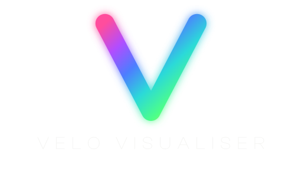

<p align="center">
  
</p>

## Velo Visualiser for macOS: Low Latency Music Visuals

Velo Visualiser is a macOS audio visualiser engineered around one primary
objective: **low latency**.

Point it at any audio input and the picture moves with the sound. The app hears,
analyses and draws in **under 10 ms**; the finished frame then rides the normal
display pipeline that no app can skip, reaching your eyes in roughly
**10 to 25 ms** end to end on a 120 Hz display.

It is the Mac sibling of the Android
[Velo Visualiser](https://github.com/rorygallagher2024/velo-visualiser/) and
shares its design language and its visuals, but not a line of its code. This one
is Swift and Metal 4 throughout, Apple Silicon only, with no compatibility
layers in the way.

## What's the app for

1. **Visualising music on a Mac.** A modern take on the classic desktop
   visualisers, except now at 120 fps with HDR highlights, on a canvas that
   fills whatever display you give it.

2. **A live performance tool.** It is built to be captured. The canvas carries
   no on screen controls at all, so nothing of the app's own interface can land
   in a recording or a stream, and everything is on a key instead. Point a
   capture source at the window, or run it fullscreen on a projector or a second
   display.

3. **Watching what your mix is actually doing.** Over half the visuals are
   instruments rather than decoration: a real third octave analyser, two
   oscilloscopes and a peak reading LED panel, all fed from the same low latency
   capture.

## Core Features

* **High-FPS, HDR-Capable Visuals:** Targets 120 fps and holds it, with real
  highlights on displays that support extended range.
* **Any Core Audio Input:** Route your system output through a loopback device
  and visualise whatever is playing, or take your interface's feed directly.
  Anything macOS lists as an input can drive it.
* **Twelve Visuals:** Seven instruments and five generative scenes, all ported
  from the Android app.
* **Built to be Captured:** No on screen chrome, keyboard only control, and a
  frame rate cap so you are not rendering frames a 60 fps stream will never
  sample.
* **Fullscreen That Actually Runs Fullscreen:** On a scaled desktop the app
  claims the panel's native mode, which recovers a third of the frame rate the
  compositor would otherwise spend downsampling.
* **No Nonsense:** 100% local processing. No data collection. No ads. No network
  access at all.

## The visuals

**Instruments**, which are honest readouts of the signal:

* **Spectrum Analyser.** Thirty one third octave bands with peak programme
  ballistics and gravity peak caps.
* **Raw Oscilloscope.** A single hairline straight from the audio at flat linear
  gain. No smoothing and no auto gain, so a hot signal genuinely runs off the top
  rather than being flattered.
* **Phosphor Scope.** The same trace as a CRT: a bright filament in a coloured
  halo, with edge fringing and beam dwell.
* **Circular Spectrum.** The reading bent into a ring, 128 bars with peak dots.
* **Pocket LED.** A dot matrix panel on the green through amber to red hardware
  ladder, with a standby that wakes on the first signal.
* **Spectrum Bars.** The classic coloured bars with gravity peak caps.
* **3D LED.** The LED panel as an actual object, lenses and chassis, with a
  camera drifting around it.

**Generative**, which are driven by the sound rather than measuring it:

* **Tunnel.** An infinite hexagonal corridor with bass ripples travelling away
  down it.
* **Laser Array.** Beams out of a vanishing point, the way a rig full of
  scanners looks through haze.
* **Spectral Bloom.** A kaleidoscope over a fractal flow.
* **Aurora Drift.** Curtains of light over a parallax starfield.
* **Quicksilver.** A mass of liquid metal, raymarched, reflecting a room that is
  also the background.

## Controls

The canvas carries no on screen controls, so everything is a key.

| Key | |
|-----|-----|
| `M` | show or hide the controls |
| `F` | fullscreen |
| `H` | HDR on or off |
| `1` to `9`, `0` | jump to a visual |
| `left` `right` | step through the visuals |

## Why Velo Visualiser is Fast

### The simple breakdown

Capture runs on Core Audio's AUHAL layer at the smallest buffer the device will
give, straight into a lock free ring that the render thread reads. Nothing
allocates, locks or blocks on the audio thread, and nothing is copied between
the two. The result is that the app hears, analyses and draws in **under 10 ms**.
The finished frame then travels the display pipeline like every app's frames do.

### The detailed breakdown

| Stage | Component | Latency |
|---|---|---|
| **Capture** | Core Audio AUHAL at the device minimum buffer | ~1.5 ms |
| **Ingest** | Lock free ring write | < 0.1 ms |
| **Analysis** | 1024 point FFT into 128 bins, plus scene ballistics | < 0.2 ms |
| **Render** | Metal 4 shader execution | 0.5 to 7 ms |
| **App total** | **Input to finished frame** | **~2 to 9 ms** |
| **Display** | Vsync and compositor at 120 Hz | ~8 to 16 ms |
| **TOTAL** | **Input to eyes** | **~10 to 25 ms** |

Analysis and render figures are measured rather than estimated. The spread on
render is the difference between the cheapest instrument and the heaviest
raymarched scene, at 8.1 megapixels.

Two decisions do most of the work. The app runs two frames in flight rather than
three, because a third buffers against a GPU overrun that does not happen here
and charges a whole frame of delay to do it. And ballistics live in the scenes,
expressed in seconds rather than in frames, instead of being smoothed once by the
engine and then again by the scene.

## Requirements

Apple Silicon and macOS 26 or newer, deliberately. There is no Intel path and no
Metal 3 fallback. The point of this app is to sit on the current graphics stack
rather than carry compatibility code nobody on the project will run.

## Building from Source

```bash
./build.sh
open "build/Velo Visualiser.app"
```

`build.sh` compiles with SwiftPM, assembles the `.app`, builds the icon and signs
ad hoc. There is no Xcode project on purpose: everything is text, so the whole
app is diffable and buildable from a terminal. Built and tested with Xcode 26.6
and Swift 6.3.

The first launch asks for microphone access. Core Audio input is gated by privacy
consent even when the device is a loopback, so this is required. The app is not
listening to your microphone unless you pick it.

Implementation notes, measurements and the reasoning behind the awkward parts are
in [IMPLEMENTATION.md](IMPLEMENTATION.md).

## License

Velo Visualiser is **free and open source software**, licensed under the
**GNU General Public License v3.0**. See [LICENSE](LICENSE).

You're free to use, study, modify, and redistribute it. Any distributed
derivative must also remain GPLv3.

The **Velo Visualiser name, logo, and icons are trademarks and are not covered by
the GPL** (see [TRADEMARKS.md](TRADEMARKS.md)). Forks must rebrand.

No data collection, no ads, no tracking: local only, and it'll stay that way.

## Support

Velo Visualiser is free but its development cost is not, so if it brings some
colour to your music and you'd like to chip in for coffee, it's hugely
appreciated:

<a href="https://www.buymeacoffee.com/rorygallagher2024"></a>

## About the Developer

Velo Visualiser was engineered by me, Rory Gallagher. I am an Engineer with over
14 years of experience in enterprise software architecture and currently leading
innovation and experimentation teams. My day-to-day focus centers on leading
teams to evaluate and build enterprise capabilities using emerging technologies.

Building Velo Visualiser is a culmination of my interests in music technology and
audio science, live performance, hardware, software engineering and IoT.

Feel free to connect:
* **LinkedIn:** [linkedin.com/in/rory-gallagher-51822532](https://www.linkedin.com/in/rory-gallagher-51822532)
* **YouTube:** [youtube.com/@rorygallagher-redslug](https://www.youtube.com/@rorygallagher-redslug)
* **Medium:** [medium.com/@rorygallagher2010](https://medium.com/@rorygallagher2010)
